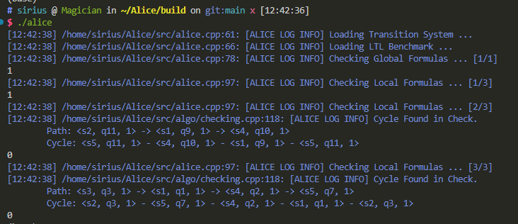

# Alice

<div align="center">
	
</div>


[Docs (Parser)](docs/Parser.md) | [Docs (Screenshots)](docs/Screenshots.md)

Alice is an [A]utomatic [Li]near Temporal Logic [C]hecking Syst[e]m implemented in C++.

The avatar of Alice project (The picture above) is generated by [Stable Diffusion](https://huggingface.co/spaces/stabilityai/stable-diffusion), using the prompt *Mr. white rabbit, Alice in Wonderland* 


## Build

Alice adopts CMake as the build tool and use Makefile script to generate YACC parser.

By default the parser has already been generated and put in the project, so for using we just need to run the CMake. But you can also modify the parser and regenerate it.

#### Build the Project

To directly build the executable

```bash
# make the build directory
mkdir build
cd build

# run cmake and make
cmake ..
make
```

You can also use CMake + Ninja:

```bash
cmake .. -G Ninja
ninja
```

And you will get the executable `alice` and `alice_test` under the `build/` directory.

#### Regenerate YACC Parser (Optional)

Alice uses [Flex](https://github.com/westes/flex) + [Bison](https://gnu.org/software/bison/) for LTL Parser. (Versions: flex 2.6.4, bison 3.5.1)

The Lexer (`ltllexer.l`) and Parser (`ltlparser.y`) is implemented under `src/ltl/yacc/` . Other files (`.hpp` and `.cpp`) are generated by YACC.

To regenerated these files, run `make` in the root of the directory; use `make clean` to clean these generated files.


## Run and Test

After successfully building Alice, the project should be like

```
├── build
│   ├── alice
│   └── alice_test
├── data
│   ├── TS.txt
│   └── benchmark.txt
└── run
```

- Alice uses relative path to search for inputs. So you should run `alice` **under the `build/` directory**.
- Alice takes inputs from `data/TS.txt` (for transition system) and `data/benchmark.txt` (for LTL formulas).
- Alice dumps intermediate results into files under the directory `run/`. These files include:
  - `run/TS.txt`  The loaded transition system.
  - `run/LTL.txt`  The parsed LTL formulas.
  - `run/Check_Log_Global_Formula/Local_i.txt`  Intermediate results when checking i-th global / local LTL formula, including GNBA, NBA and product TS. 
- Alice outputs some other log information into `stderr`.
- Alice outputs the results into `stdout`.

#### Run

Run `alice` under the `build/` directory, and you will see the following output in the terminal.



#### Test

I write several unit tests for different components in Alice in `alice_test`. If you are interested, run it under the `build/` directory.


## Implementation

The project structure `src` is as follows

```
├── algo            // main algorithms implementation
├── alice.cpp       // entry file for Alice
├── alice_test.cpp  // entry file for test
├── automata        // definitions for NBA and GNBA
├── frontend        // read TS and LTL from files
├── ltl             // LTL AST and passes
├── ts              // transition system
└── utils           // logging and other tool functions
```

The workflow


#### LTL

```
├── ast.cpp
├── ast.hpp
├── closure_analyzer.cpp
├── closure_analyzer.hpp
├── parser.cpp
├── parser.hpp
├── printer.cpp
├── printer.hpp
├── tree_deleter.cpp
├── tree_deleter.hpp
└── yacc
    ├── ltllexer.cpp
    ├── ltllexer.l
    ├── ltlparser.cpp
    ├── ltlparser.hpp
    └── ltlparser.y
```

##### Parser

Alice uses [Flex](https://github.com/westes/flex) + [Bison](https://gnu.org/software/bison/) for LTL Parser. The Lexer is defined in `yacc/ltllexer.l` and the parser is defined in `ltlparser.y`. Other files under `yacc/` are generated automatically by Flex and Bison. For convenience usage, I wrap the parser with a portable method `parseLTLFromString` in `parser.hpp` .

Loading LTL from file `benchmark.txt` is implemented in `frontend/benchmark.hpp`.

See the [docs for parser](docs/Parser.md) for more information.

##### AST

The Abstract Syntax Tree of LTL is defined in `ast.hpp` with several types of nodes.

Passes (LTL Visitors) including `printer` for LTL, `tree_deleter` for freeing memory and `closure_analyzer` for collecting closure and elementary sets in the formula.

##### Closure Analyzer

The `ClosureAnalyzer` will collect the closure of the formula (*Principles of Model Checking*, P276, Definition 5.34) and the elementary sets (*Principles of Model Checking*, P277, Figure 5.20.).

#### TS

```
├── components.hpp
├── ts.cpp
└── ts.hpp
```

Components (`State`, `Action`, `Transition` and `AtomicProposition`) of TS are defined in `components.hpp` and the main class `TransitionSystem` is in `ts.hpp`.

Loading TS from file `TS.txt` is implemented in `frontend/ts_builder.hpp`.

 #### Automata

```
├── ba.cpp
├── ba.hpp
└── components.hpp
```

Components (`State` and `Symbols`) of BA are defined in `components.hpp`. GNBA (`class GeneralizedBuechiAutomata`) and NBA (`class NondeterministicBuechiAutomata`) lie in `ba.hpp`, inheriting `BuechiAutomata`.

#### Algorithms

```
├── algo.hpp
├── checking.cpp
├── gnba2nba.cpp
├── ltl2gnba.cpp
├── product.cpp
├── utils.cpp
└── utils.hpp
```

These four algorithms are all declared in `algo.hpp` with implementations in separate `.cpp` files in this directory.

##### LTL Formula to GNBA

*Principles of Model Checking*, P278, Theorem 5.37.

After applying `ClosureAnalyzer`, we get the closure and the elementary sets. With these information, we are able to construct `GNBA` by following the definitions. And to make the `GNBA` **non-blocking**, we add a trap state to address that.

##### GNBA to NBA

*Principles of Model Checking*, P195, Theorem 4.56.

We add a special filed `index_` in `automata::State` to represent `k` in the NBA state `<q, k>` . The conversion basically follows the method described in the theorem.

##### Product of TS and NBA

*Principles of Model Checking*, P200, Definition 4.62.

The product of TS and NBA is another TS. The construction follows the definition of product. For convenience, we maintain a map `sq_map_` which maps `pair(s, q)` to the new state `<s, q>` in product TS, where `s` is the state in input TS and `q` is the state of the NBA.

##### Persistence Checking

*Principles of Model Checking*, P211, Algorithm 8.

We use the nested depth-first search which contains an outer DFS and an inner DFS to check whether the TS satisfies the persistence property.

If a cycle is found, the path to the cycle (contents in the stack `U`) and the cycle (contents in the stack `V`) will be dumped to the LOG.


## Screenshots

See the [docs of screenshots](docs/Screenshots.md) to see what it looks like when running a simple example.