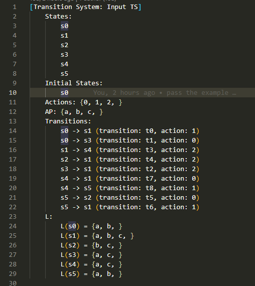
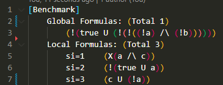
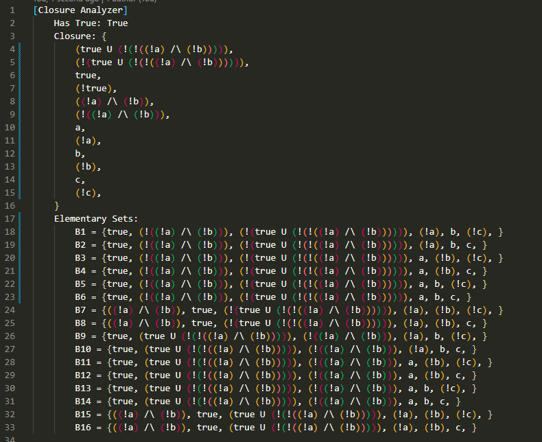
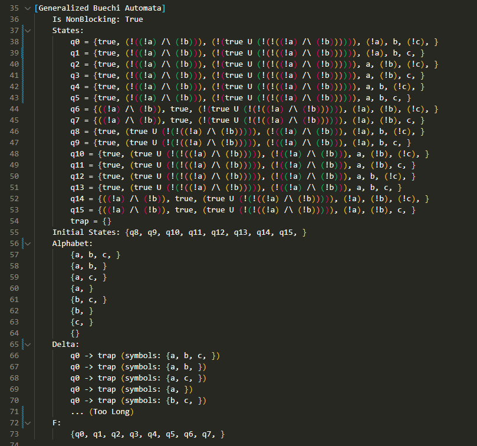
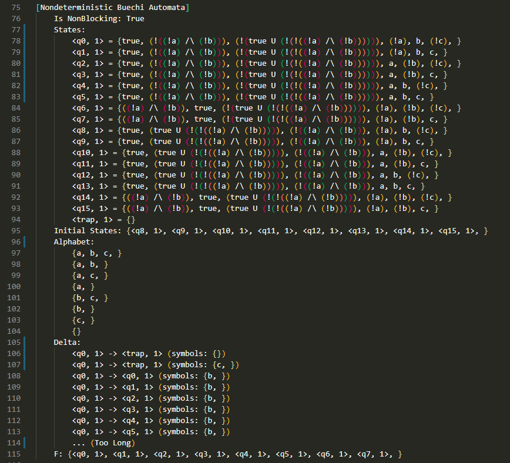
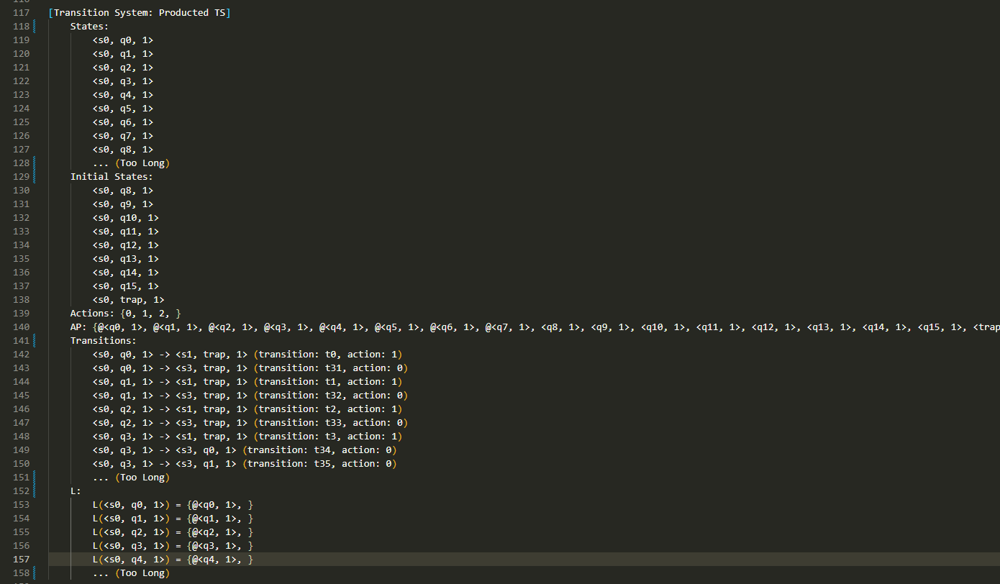

# Algorithms

Taking the `data/example1` as the example input, and we present some intermediate results in `Check_Log_Global_Formula_1.txt` .

### TS

Transition systems constructed from `TS.txt`

### LTL Benchmark

LTL Benchmark constructed from `benchmark.txt`

### Closure Analysis

The closure and the elementary sets

### LTL Formula to GNBA

The constructed GNBA (The delta function is too long to be shown)

### GNBA to NBA

The converted NBA (The delta function is too long to be shown)

### Product of TS and NBA

The product TS (States, Transitions and L are too long to be shown)

